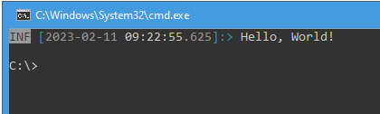
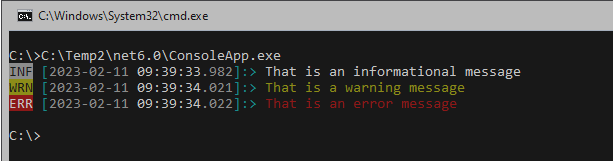

# Trace to Console Window

If u want to show trace messages in the Console Window u have to add a `ConsoleTraceListener` and u have to enable `TRACE`.

```csharp
using System.Diagnostics;

namespace ConsoleApp
{
    internal class Program
    {
        static void Main(string[] args)
        {
            Trace.Listeners.Add(new ConsoleTraceListener());
            Trace.TraceInformation("Hello, World!");

            // Output
            // ConsoleApp Information: 0 : Hello, World!
        }
    }
}
```

Now let us use the `ConsoleColorCodeTraceAdapter`. It will changes the output format and the output is colorized.

```csharp
using Logging.Tracing.Adapters;
using Logging.Tracing;
using System.Diagnostics;

namespace ConsoleApp
{
    internal class Program
    {
        static void Main(string[] args)
        {
            ConsoleColorCodeTraceAdapter adapter = new();
            AdapterTraceListener listener = new(adapter);
            Trace.Listeners.Add(listener);

            Trace.TraceInformation("Hello, World!");

            // Output
            // INF [2023-02-11 09:19:15.372]:> Hello, World!
        }
    }
}
```



If u dont want to write that code manually u can use the `TraceUtil.AddConsoleColorCodeToTrace`.

```csharp
using Logging.Tracing;
using System.Diagnostics;

namespace ConsoleApp
{
    internal class Program
    {
        static void Main(string[] args)
        {
            // did the work for u
            TraceUtil.AddConsoleColorCodeToTrace();

            Trace.TraceInformation("Hello, World!");

            // Output
            // INF [2023-02-11 09:19:15.372]:> Hello, World!
        }
    }
}
```

The ``Trace`` has three methods we want to use.

```csharp
using Logging.Tracing;
using System.Diagnostics;

namespace ConsoleApp
{
    internal class Program
    {
        static void Main(string[] args)
        {
            TraceUtil.AddConsoleColorCodeToTrace();

            // the three levels we did support
            Trace.TraceInformation("That is an informational message");
            Trace.TraceWarning("That is a warning message");
            Trace.TraceError("That is an error message");
        }
    }
}
```


