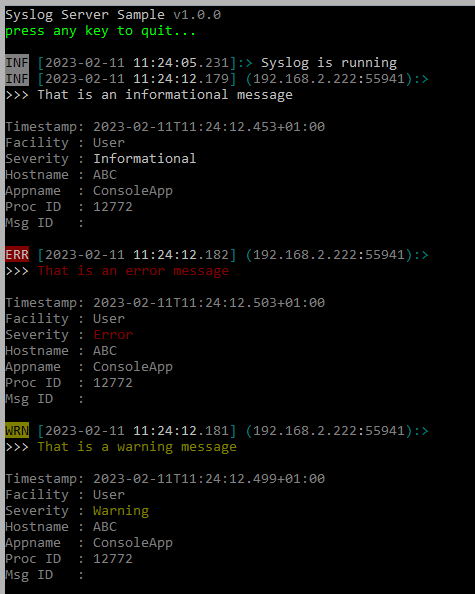

# Trace to Syslog

If u want to write trace message to syslog u have to enable `TRACE`.

This library has its own syslog implementation and did not use a stream in conjunction with a TextWriterTraceListener.

```csharp
using Logging.Tracing;
using Logging.Tracing.Adapters;
using Syslog.Transport;
using Syslog;
using System.Diagnostics;

namespace ConsoleApp
{
    internal class Program
    {
        static void Main(string[] args)
        {
            // Create Syslog Client
            UdpSender    sender = new(remoteHost: "localhost");
            SyslogClient syslog = new(sender);

            // Add Syslog Trace
            SyslogTraceAdapter   adapter  = new(syslog);
            AdapterTraceListener listener = new(adapter);
            Trace.Listeners.Add(listener);

            // Try to connect
            syslog.Open();

            Trace.TraceInformation("That is an informational message");
            Trace.TraceWarning("That is a warning message");
            Trace.TraceError("That is an error message");

            Trace.Close();
        }
    }
}
```

> If u dont have a syslog server, u can use the SampleServer

The trace messages are send to the syslog server.



If u dont want to write that code manually u can use the ``TraceUtil.AddSyslogToTrace``.

```csharp
using Logging.Tracing;
using System.Diagnostics;

namespace ConsoleApp
{
    internal class Program
    {
        static void Main(string[] args)
        {
            // did the work for u
            TraceUtil.AddSyslogToTrace("localhost");

            Trace.TraceInformation("That is an informational message");
            Trace.TraceWarning("That is a warning message");
            Trace.TraceError("That is an error message");

            Trace.Close();
        }
    }
}
```

If u have more than one syslog server u can use ``TraceUtil.AddSyslogToTrace("localhost server1 server2")``.

