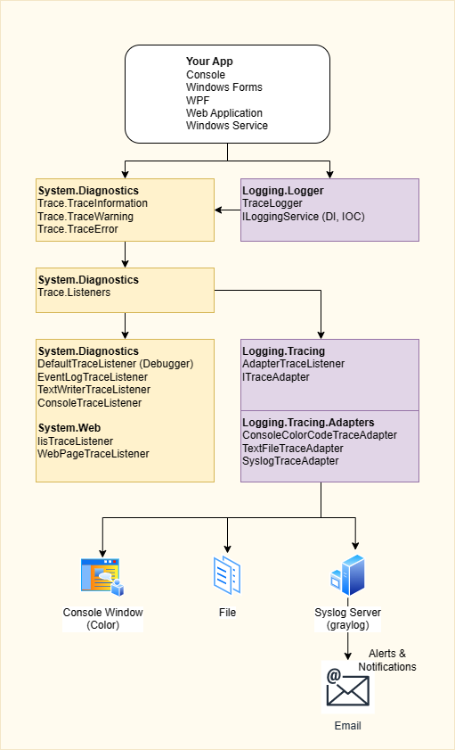

# Syslog

The focus of this project is "How to use trace output for unified logging" and "How can i send trace output to a syslog server".

## Tracing vs. Logging vs. Telemetry

In many of my small projects i have a simple trace output during development and the output is written to logfiles in production.

Seems to be good but there are some problems:
- logfiles are unreaded, except someone tells me that there is a problem
- some projects have logfiles but not all
- logfile names and content are not unified
- cleanup logfiles can be different from project to project
- code is blow up with repeated code
- logfiles not written on access denied errors and app is chrashing

We monitoring most of the infrastructure components in the company network with Zabbix.

That is ok, that is good, have a look of them. But here we cannot look inside the applications, so the app has to tell us that there is a problem.

That is why we need logging. To simplify the terms we can say that logging is a smaller part of tracing, and tracing is a smaller part of debug output.

For ``Debug`` output we can use `System.Diagnostics.Debug` and for ``Trace`` output we can use `System.Diagnostics.Trace`. When we neither define `DEBUG` or `TRACE` in the project, then we dont have any output!

At this point we have to think about logging, DI, IoC and maybe IoT.

There are many frameworks who can do that.

But now i go back to my problem "how can i made older projects syslog ready".

All these projects use Trace and Logfiles. So i put all the code i need for that in a NuGet-Package, so i can include them.

And now i can unify the trace outputs, logfile names, delete behaviour and i can add a syslog trace to that package.

This project here shares these parts with u.

## Content
- Logging (Console, Files, Syslog)
- Syslog (RFC 5424 UDP)
- SampleClient (client demo)
- SampleServer (syslog server demo)

|||
|-|-|
|Target|net47;net6.0;net6.0-windows|
|Editor|VS2022|

## Point of view

